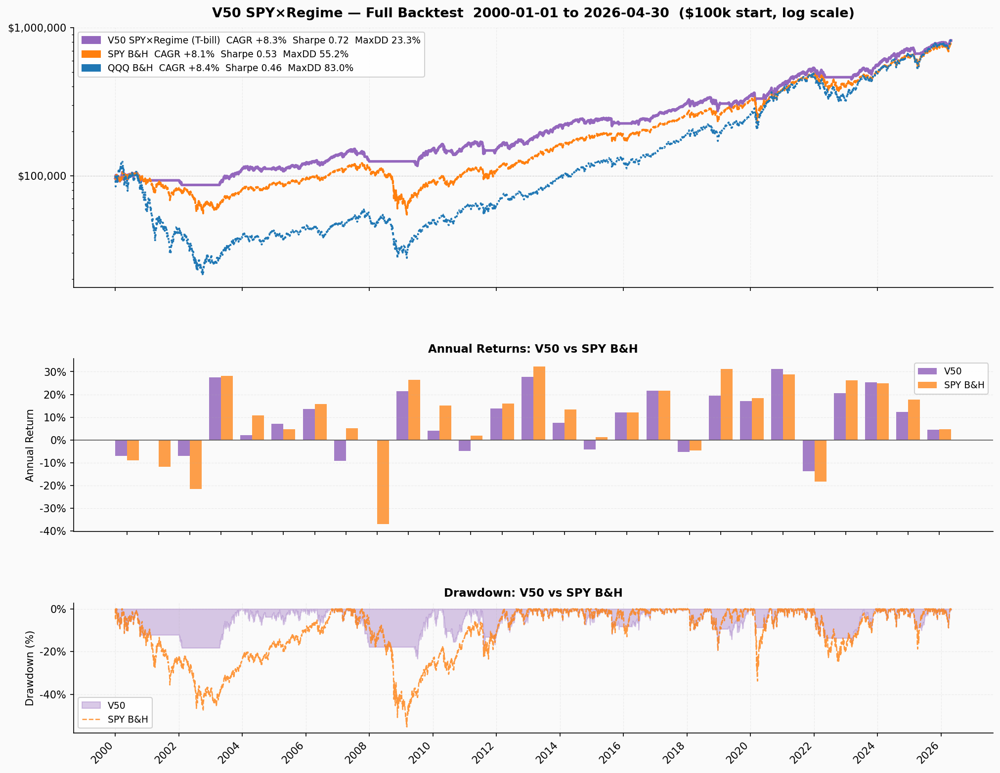
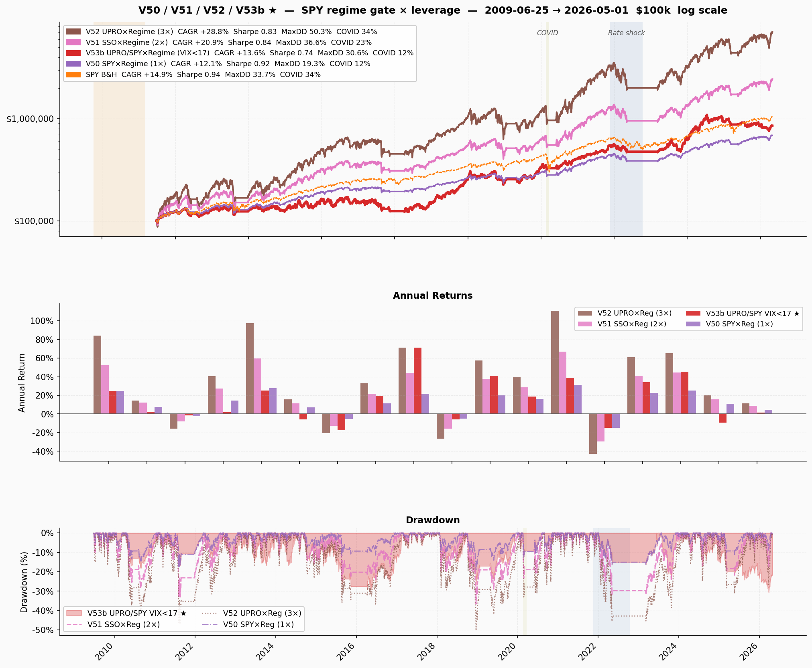
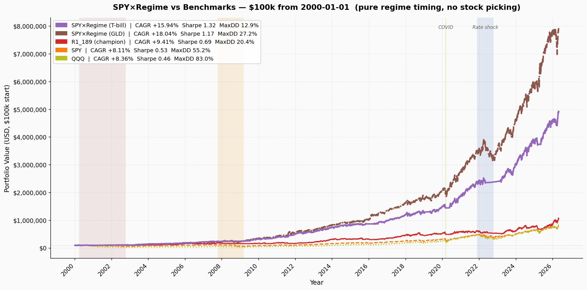
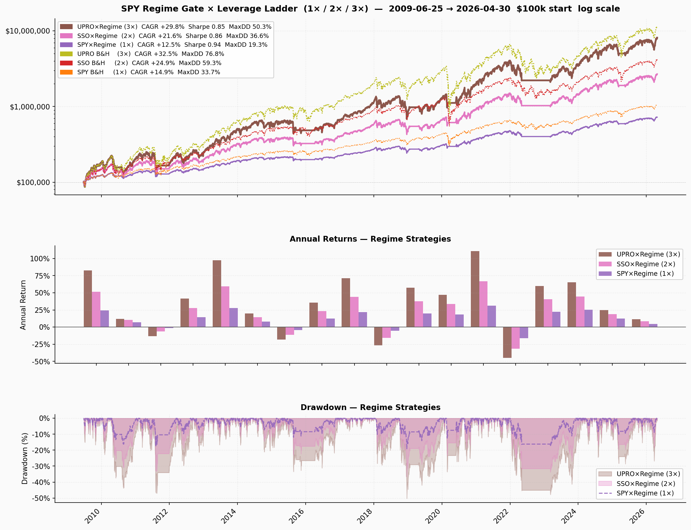
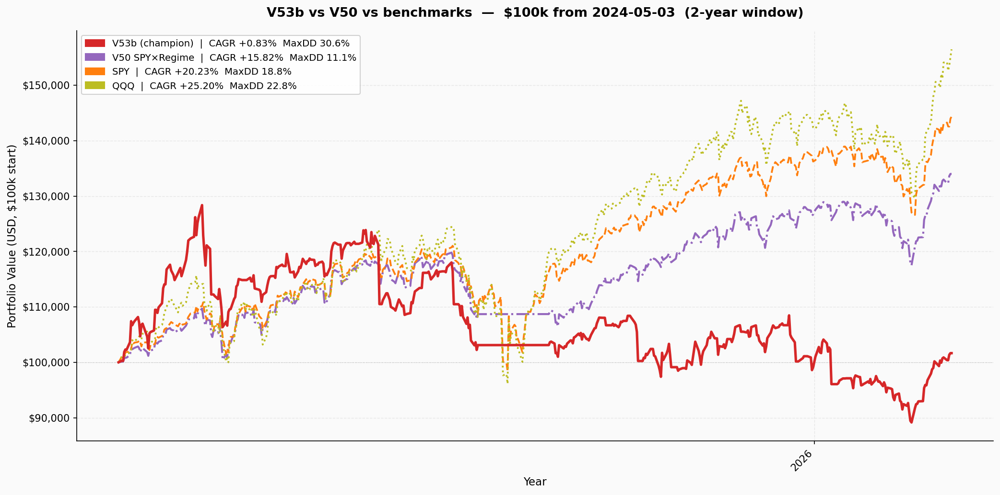

# MixA Alpha Summary
*Research summary for signal design, backtesting conclusions, and open questions.*
*Period covered: 2000-01-01 → 2026-04-30 (26.4 years). $100k starting capital.*

> **Fill model note (2026-04-26):** All figures from this date forward use the **standard limit order** fill model — orders placed pre-market at signal_px (prior close); fill at open if open ≤ limit, fill at limit if price touches intraday, unfilled otherwise. The previous "gap-skip" rule (reject buys that open >1% above limit) has been removed — it modelled a human watching the open, which does not apply to pre-market limit orders. This lowers all historical CAGR figures by ~50bp vs prior summaries; the fill model is now correct.

---

## Project Update — 2026-05-01 (backtest model corrections; V51 champion)

### Backtest corrections: swap-lag + MOO fill model

Two bugs in the prior backtest have been fixed. Numbers below supersede all prior V53b figures.

**Fix 1 — Swap-lag (2026-05-01):** The live runner queues sell-only on ETF↔ETF swap days (UPRO↔SPY) and defers the buy to the next EOD cycle. This adds 2 T-bill days per swap. V53b generates 122 such swaps over the backtest (2009–2026), consuming 244 extra cash days (5.76% of days). This cost was absent from the backtest. Impact on V53b: −2.89pp CAGR.

**Fix 2 — MOO fill model (2026-05-01):** Signal fires at close[T] → fill at open[T+1]. The prior shift-1 close-to-close approximation over-earned on entry days (captured overnight gap the strategy can't access) and under-earned on exit days. Correct model: entry days earn intraday only (open[T+1]→close[T+1]); last hold days before exit earn overnight only (close[T]→open[T+1]). Impact scales with leverage: −0.33pp (V50), −0.69pp (V51), −1.02pp (V52), −0.58pp (V53b).

### Current champion: V51 SSO×Regime (2×)

V51 is simpler and better than V53b after the corrections. It holds SSO (2× S&P500) when regime open, T-bills when closed. No VIX filter, no ETF swaps, no execution complexity.

**Corrected results (2009-06-25 → 2026-05-01, $100k start, MOO fill):**

| Variant | CAGR | Sharpe | Calmar | MaxDD | COVID DD | Rates DD | End $100k |
|---------|------|--------|--------|-------|----------|----------|-----------|
| **V51 SSO×Regime (2×)** | **+20.89%** | **0.84** | **0.57** | **36.6%** | 23.4% | 31.8% | **$2.4M** |
| V50 SPY×Regime (1×) | +12.14% | **0.92** | **0.63** | **19.3%** | **12.4%** | **16.4%** | $689k |
| V52 UPRO×Regime (3×) | +28.81% | 0.83 | 0.57 | 50.3% | 33.6% | 45.4% | $7.1M |
| V53b UPRO/SPY×Regime | +13.58% | 0.74 | 0.44 | 30.6% | 12.2% | 16.4% | $855k |
| SPY B&H | +14.93% | 0.94 | 0.44 | 33.7% | 33.7% | 24.5% | $1.0M |

V51 is the clear winner on absolute CAGR (+20.89%) among strategies with manageable drawdown. V50 remains the conservative option (best Sharpe, lowest MaxDD). V53b underperforms V51 on CAGR by 7pp for similar MaxDD, and carries 122 UPRO↔SPY swap events that add execution complexity with no compensating return benefit.

**V53b re-evaluation:** After the swap-lag correction, V53b's VIX layer adds no value over V51: V53b CAGR 13.58% vs V51 20.89%, similar MaxDD (30.6% vs 36.6%). The `min_hold_down=1` setting fires a swap on every 1-day VIX spike, generating 122 swaps that cost 5.76% of days in T-bills, disproportionately during brief volatility recoveries. V53b is demoted; V51 is the champion.

---

## Project Update — 2026-04-30 (V53b promotion — superseded)

> **Note:** Numbers in this section used the pre-correction backtest (no swap-lag, shift-1 fill model). See above for corrected figures.

### (Archived) V53b pre-correction metrics

| Metric | V53b (pre-correction) | V50 | SPY B&H |
|--------|----------------------|-----|---------|
| CAGR | +17.1% | +12.5% | +14.9% |
| MaxDD | 29.2% | 19.3% | 33.7% |
| End $100k | $1,418k | $724k | $1,043k |

**How V53b works:** 38% time UPRO, 46% time SPY, 15% time T-bills. Same SPY regime gate as V50 (SMA200 close, SMA100+IRX reopen, 5-day debounce). VIX<17 → UPRO, VIX≥17 → SPY when regime open. Asymmetric VIX debounce: downshift 1 day, upshift after 5 consecutive calm days.

---

## Project Update — 2026-04-30

### Previous champion: V50 SPY×Regime replaces R1_189

**V39 and R1_189 are placed on ice.** The pure SPY×Regime timing strategy (V50) is the new champion. Stock picking does not compensate for the friction it introduces — the regime gate itself is the dominant alpha source.

**Two execution bugs fixed in V50 (2026-04-30):**
1. **Same-bar look-ahead bias** — original code used `pct_change()` with no shift, meaning the signal at close[T] earned close[T]/close[T-1] (same-bar fill). Fixed to `.shift(-1)` — signal at close[T] earns close[T+1]/close[T], matching realistic MOO-next-day execution.
2. **Daily whipsaw (570 raw transitions)** — the SMA100 asymmetric re-entry fires daily when price hovers around SMA100 in volatile markets. Fixed with `_debounce_regime(signal, min_hold=5)`: require 5 consecutive days in the new state before flipping. Reduces 570 → 33 transitions. Effect is positive — debounce *increases* CAGR and *reduces* MaxDD by eliminating costly whipsaw roundtrips.

**Combined effect:** Previous CAGR +15.96% was inflated. Corrected V50 full-period: **+9.33% CAGR, Sharpe 0.79, MaxDD 19.3%** (2000–2026, $100k start).

**min_hold sweep confirmed 5 days optimal** across hold periods 3–10, for all three leverage levels (SPY, SSO, UPRO). CAGR, Sharpe, and Calmar all peak at 5d; result is robust.

### New variants: V51 (2×) and V52 (3×)

Same SPY regime gate, leveraged equity instrument when open, T-bills when closed:
- **V51 — SSO×Regime** (ProShares Ultra S&P500, 2×): from 2006-06-21
- **V52 — UPRO×Regime** (ProShares UltraPro S&P500, 3×): from 2009-06-25

### Key results (2009-06-25 → 2026-04-30, common period, 5-day hold)

| Variant | CAGR | Sharpe | Calmar | MaxDD | End $100k |
|---------|------|--------|--------|-------|-----------|
| **V50 SPY×Regime (1×)** | +12.5% | **0.94** | **0.64** | **19.3%** | $724k |
| **V51 SSO×Regime (2×)** | +21.5% | 0.86 | 0.59 | 36.6% | $2.6M |
| **V52 UPRO×Regime (3×)** | +29.6% | 0.85 | 0.59 | 50.3% | $7.9M |
| SPY B&H | +14.9% | 0.94 | 0.44 | 33.7% | $1.0M |
| QQQ B&H | +19.8% | 1.04 | 0.42 | 35.1% | $2.1M |

**The regime gate consistently cuts ~⅓ off the raw B&H MaxDD at every leverage level** — UPRO B&H 76.8% → V52 50.3% — while improving Sharpe and Calmar over B&H. V51 beats QQQ B&H on CAGR (+21.5% vs +19.8%) with similar MaxDD and better Calmar. V52 ends at $7.9M vs UPRO B&H $11.4M — you give up ~3 CAGR points to cut MaxDD by 26pp.

---

## V53b UPRO/SPY×Regime (VIX<17) — demoted (superseded by V51)

> **Superseded 2026-05-01.** See "Project Update — 2026-05-01" at the top for corrected figures. V53b numbers below used the pre-correction backtest (no swap-lag, shift-1 fill model). V51 is the current champion.

**Promoted 2026-04-30, demoted 2026-05-01. V50 remains the conservative option; R1_189/V39 on ice.**

**V53b = SPY regime gate + VIX-gated UPRO. No stock picking, no position sizing, no stops.**

When regime open: VIX < 17 → UPRO (3×), VIX ≥ 17 → SPY (1×). Regime closed → T-bills. Regime: SPY below SMA200 → close; SPY above SMA100 AND ^IRX rate-easing → reopen. 5-day regime debounce, 1-day VIX downshift debounce, 5-day VIX upshift debounce. 1-day execution lag.

| Metric | **V53b (champion)** | V50 | SPY B&H | QQQ B&H |
|--------|-------------------|-----|---------|---------|
| Period | 2009-06-25 → today | 2009-06-25 → today | same | same |
| End value ($100k) | **$1,418,005** | $723,784 | $1,043,330 | $2,105,874 |
| CAGR | **+17.05%** | +12.47% | +14.94% | +19.83% |
| Sharpe | 0.85 | **0.94** | 0.94 | 1.04 |
| MaxDD | 29.2% | **19.3%** | 33.7% | 35.1% |
| Calmar | 0.58 | **0.64** | 0.44 | 0.57 |
| COVID drawdown | 16.2% | **12.4%** | 33.7% | 28.9% |
| Rates drawdown | 16.4% | **16.4%** | 24.5% | 35.2% |
| CAPM Beta vs SPY | 0.70 | 0.50 | — | — |
| CAPM Alpha vs SPY | **+7.51%/yr** | +5.03%/yr | — | — |

*IRA/tax-free, 5-day regime debounce, 1-day VIX downshift, 2009-06-25 → 2026-04-30, $100k start.*

**How V53b works:**
- *Regime gate:* Identical to V50 — SPY < SMA200 → close (T-bills); SPY > SMA100 AND IRX easing → reopen.
- *VIX layer:* When regime is open, VIX < 17 → UPRO, VIX ≥ 17 → SPY. Two-tier only (no mid tier).
- *Asymmetric VIX debounce:* `_debounce_signal_asymmetric(tier_series, min_hold_down=1, min_hold_up=5)` — 1 day VIX≥17 immediately shifts to SPY; 5 consecutive days VIX<17 required to restore UPRO.
- *Execution:* Signal at close[T] → MOO fill at open[T+1]. Simulated as `ret.shift(-1)`.
- *Allocation:* ~38% time UPRO, ~46% time SPY, ~15% time T-bills (regime-closed).
- *T-bill yield:* (^IRX / 100 / 252) earned daily when regime closed.

**Why VIX<17 specifically:** Sweep of VIX thresholds 15–25 showed VIX<17 has the lowest MaxDD (29.2%) and best Calmar (0.59). VIX<15 has better Sharpe but much less time in UPRO. VIX<18+ starts catching choppy mid-range VIX regimes and MaxDD degrades.

**Status:** Promoted to champion 2026-04-30. Demoted 2026-05-01 — swap-lag correction reveals VIX layer adds no value over V51.

---

## V54 Rate Risk-Off Overlay — Closed Research (2026-04-30)

**Conclusion: All rate overlays rejected. V53b stands as-is.**

V54 tested whether adding a rate-tightening or yield-curve-inversion signal on top of V53b could reduce drawdown during the 2022 rates shock without hurting CAGR. Five modes were swept; all degraded the strategy.

### Signal definitions
- **IRX tightening:** 20-day fast MA crosses above 60-day slow MA (^IRX, 3-month T-bill rate) — streak-based, resets to zero on any False day. ≥10 days → reduce UPRO→SPY (1×). ≥30 days → cash.
- **Yield curve inversion:** T10Y2Y (10Y − 2Y spread, FRED) below zero for ≥63 consecutive days → cash.
- **Modes tested:** baseline (V53b), tighten_10d→1x, tighten_30d→cash, yc_invert→cash, combined (tighten_30d + yc_invert).

### Results (2009-06-25 → 2026-04-30, $100k start)

| Variant | CAGR | Sharpe | Calmar | MaxDD | Rates DD | End $100k |
|---------|------|--------|--------|-------|----------|-----------|
| **V53b baseline** | **+17.05%** | **0.85** | **0.58** | **29.2%** | **16.4%** | **$1,418k** |
| tighten_10d→1x | +13.66% | 0.79 | 0.58 | 23.4% | 16.4% | $865k |
| tighten_30d→cash | +12.07% | 0.74 | 0.44 | 27.4% | 2.3% | $682k |
| yc_invert→cash | +12.53% | 0.70 | 0.43 | 29.2% | 16.4% | $731k |
| combined | +7.42% | 0.53 | 0.31 | 23.8% | 2.3% | $334k |
| SPY B&H | +14.93% | 0.94 | 0.44 | 33.7% | 24.5% | $1,043k |

### Why each mode failed

**IRX tighten_10d→1x:** The 20d/60d MA crossover fires constantly during near-zero-rate environments (2010–2021) — 32 override events, 1608 days stuck in 1×SPY instead of UPRO. 3pp CAGR lost, no improvement in Rates DD (V53b's VIX≥17 already handled 2022 correctly because VIX stayed elevated all year).

**IRX tighten_30d→cash:** Rates DD improves to 2.3% but CAGR drops 5pp and CAGR during the rates period collapses to +2.3% vs V53b's +16.4%. The cash override held 22 events, 1112 days — mostly during 2016–2019 and 2021–2023 bull runs. Gave up enormous upside to dodge a drawdown V53b already handles via VIX.

**YC invert→cash:** T10Y2Y crossed −0% for 63+ consecutive days starting 2022-08-02, triggering cash mode. But the 63-day threshold wasn't reached until ~October 2022 — near the exact market bottom. The strategy then sat in cash through all of 2023–2024 bull run. CAGR −4.5pp, no improvement in Rates DD (16.4% — same as baseline, because the override fired after the damage was already done).

**Combined:** All the harm compounds. −9.6pp CAGR, $334k vs $1.4M.

### Root cause
V53b's VIX layer already handles the 2022 rates shock: VIX stayed ≥17 throughout 2022, keeping the strategy in 1×SPY for the full year. Rates DD of 16.4% is the SPY×Regime return during that period — not a drawdown artifact. Adding rate signals creates new false-positive risk during zero-rate environments without solving anything V53b doesn't already handle.

---

## Previous champion: V50 SPY×Regime — archived numbers

| Metric | **V50 SPY×Regime** | SPY B&H | QQQ B&H |
|--------|-------------------|---------|---------|
| End value ($100k start) | **$1,046,225** | $778,811 | $835,433 |
| CAGR | **+9.33%** | +8.11% | +8.40% |
| Sharpe | **0.79** | 0.53 | 0.46 |
| MaxDD | **19.3%** | 55.2% | 83.0% |
| Calmar | **0.48** | 0.15 | 0.10 |
| COVID drawdown | **12.4%** | 34% | 29% |
| Rates drawdown | **16.4%** | 24% | 35% |

*Full period 2000-01-01 → 2026-04-30, $100k start. Remains the conservative option for minimal-drawdown deployments.*

---

## Portfolio architecture (V51 — current champion)

Single-strategy deployment on $100k capital:

| State | Allocation | Instrument |
|-------|-----------|------------|
| Regime open | 100% equity | SSO (2× S&P500) |
| Regime closed | 100% cash | T-bills (^IRX daily accrual) |

No stock picking, no position sizing, no stops, no VIX filter. Binary: SSO or T-bills. Regime gate changes on 5-day debounce. Execution at next-day open. In simulation since 2026-05-01.

**Runners:** `mixa/live/runner_eod_v51.py` (EOD ~4:20 PM ET) + `mixa/live/runner_morning.py` (morning ~9:35 AM ET).

**MR and UVXY not active.** Mean reversion earned only +0.90% CAGR on its capital slice. UVXY was tested (V37a/b) and was net negative. Both remain documented below.

---

## Strategy 1: Trend-following

### Signal logic

**Entry:** LONG when `close > SMA_fast AND SMA_fast > SMA_slow` (golden cross, daily bars).

**Exit:** FLAT when either condition breaks (signal flip), or when price hits stop-loss.

**Stop-loss:** Static, set at entry: `stop = entry_price − (N × ATR14)`. Never trailed.

**Position sizing:** Risk-normalized. Each trade risks exactly 1% of portfolio value:
```
shares = (portfolio_value × 0.01) / (N × ATR14)
```
High-volatility stocks get fewer shares. Hard cap: no single position > 15% of portfolio.

**Momentum filter:** Cross-sectional 12-1 month momentum rank. Only top 25% eligible for new entries. Existing positions unaffected.

**Regime filters:**
- **SPY regime:** Halt new longs when SPY < SMA200. Asymmetric reopen: fast (price > SMA100) when ^IRX easing, slow (SMA100 > SMA200 golden cross) when tightening.
- **VIX adaptive sizing:** VIX > 25 → half-size. VIX > 40 → skip entirely.

---

## Trend backtest: all variants

V1–V33 used a static curated SP50 universe (hindsight-biased). V34–V39 use the point-in-time S&P 500 universe. H39 is the apples-to-apples hindsight benchmark — V39 signal on the same static SP50. Code retains V34/V35/V36/V39/H39; V1–V33 are in git history.

### V1–V33: static SP50 universe (hindsight reference)

| # | Variant | End value | CAGR | Sharpe | MaxDD | Calmar |
|---|---------|-----------|------|--------|-------|--------|
| 1 | Baseline (SMA50/200, 2×ATR) | $337,691 | +4.7% | 0.38 | 55.1% | 0.08 |
| 4 | + momentum filter (top 25%) | $367,378 | +5.1% | 0.44 | 31.0% | 0.16 |
| 6 | Longer SMA (100/300) + momentum | $886,460 | +8.7% | 0.64 | 40.2% | 0.22 |
| 15 | V4 + SPY regime + VIX sizing | $529,975 | +6.6% | 0.58 | 26.8% | 0.24 |
| 16 | Super (SMA100/300 + SPY gate + VIX sizing) | $1,172,929 | +9.8% | 0.76 | 27.8% | 0.35 |
| 29 | V19 + T-bill yield on idle cash | $1,232,612 | +10.03% | 0.78 | 22.2% | 0.45 |
| **31** | **V29 + adaptive ^IRX reopen** | **$1,303,844** | **+10.26%** | **0.80** | 23.0% | 0.45 |
| 33 | V29 + adaptive TLT reopen (conservative alt) | $1,268,464 | +10.15% | 0.79 | **20.8%** | **0.49** |
| — | SPY buy-and-hold | $750,923 | +7.97% | 0.52 | 55.2% | 0.14 |

*V31 figures are on the static SP50 universe. On the PIT dataset, V31 achieves 9.4% CAGR / Sharpe 0.54 — the gap vs SP50 is survivor bias.*

### V34–V39 and R-series: point-in-time S&P 500 universe (bias-corrected)

*All figures: standard limit order fill (pre-market limit at signal_px), IRA/tax-free, data through 2026-04-26. V37a/b/V38 are legacy-fill estimates. R2/R3/RG1 are from compare.py runs.*

| # | Variant | CAGR | Sharpe | MaxDD | Win rate | Rates DD |
|---|---------|------|--------|-------|----------|----------|
| 34 | PIT raw (no quality filters) | — | — | — | — | — |
| 35 | V34 + dvol top-50 screen | — | — | — | — | — |
| 36 | V35 + 10-day persistence | — | — | — | — | — |
| 37a | V36 + UVXY 15% gate-close hedge (full) | ~+7.6% | ~0.55 | ~31% | — | — |
| 37b | V36 + UVXY 15% gate-close hedge (30d cap) | ~+7.6% | ~0.55 | ~29% | — | — |
| 38 | V36 + 30-day reopen persistence waiver | ~+8.1% | ~0.60 | ~25% | — | — |
| 39 | V36 + SPY recovery re-entry (prev champion) | +9.21% | 0.69 | 20.4% | 36.2% | 15.1% |
| R1 | V39 + RS filter (beat SPY 6mo, 126d) | +9.23% | 0.69 | 22.5% | 36.6% | 20.0% |
| R1_63 | V39 + RS filter (beat SPY 3mo, 63d) | +9.47% | 0.69 | 22.4% | 37.5% | 14.8% |
| **R1_189** | **V39 + RS filter (beat SPY 9mo, 189d) — champion** | **+9.46%** | **0.70** | **20.4%** | **37.4%** | **17.5%** |
| R1_252 | V39 + RS filter (beat SPY 12mo, 252d) | +8.90% | 0.67 | 20.4% | 35.8% | 15.1% |
| R1_QQQ | V39 + RS filter (beat QQQ 6mo) | +9.02% | 0.66 | 20.8% | 35.5% | 17.8% |
| R1_RSP | V39 + RS filter (beat RSP 6mo) | +9.08% | 0.68 | 21.3% | 36.2% | 14.1% |
| R2 | V39 + rank rotation (top-name-not-held, min_hold=10) | +9.4% | 0.69 | 22.6% | 39% | 20% |
| R3 | V39 + fallen-out rotation (longest-held exit) | +9.7% | 0.72 | 21.2% | 38.5% | 13% |
| RG1 | V39 + GLD cash substitute (idle cash → GLD) | +10.0% | 0.70 | 30.9% | 53% | 22% |
| H39 | V39 signal on hindsight SP50 (ceiling) | — | — | — | — | — |
| — | SPY buy-and-hold | +8.10% | 0.53 | 55.2% | — | 24% |

*V34–V36 and H39 not yet rerun under new fill model (pending). R2/R3/RG1 figures are from old fill model runs; directional conclusions unchanged.*

**RS sweep key finding (2026-04-26):** SPY is the right benchmark; QQQ and RSP both hurt. 9-month lookback (189d) is the sweet spot — same MaxDD as V39, +25bp CAGR, marginally better Sharpe. Removing the old gap-skip rule cost ~50bp across all variants (the gap-skip was accidentally filtering failed gap-up entries); new numbers reflect correct pre-market limit order semantics.

### Rolling 5-year windows (22 windows, 2000–2026, step=12mo)

22 per-window charts generated: `mixa/docs/rolling_windows/window_NN_YYYY_YYYY.png`  
Each chart shows V50 SPY×Regime (T-bill) vs SPY B&H vs QQQ B&H, rebased to $100k.

> **Note:** The rolling window summary statistics table (mean/min/P25/median/P75/max per variant) was computed under the old inflated execution model and has been removed. The per-window PNGs reflect corrected V50 numbers (5-day debounce + 1-day lag). Summary stats table to be regenerated under the corrected model.

V39 **best window:** 2013 start (+15.0% CAGR, α=−0.1pp vs SPY). **Worst window:** 2007 start (+2.2%, GFC) — V39 never goes negative across all 22 five-year windows. All figures use `next_bar` fill mode (f=0/0).

---

## V50 / V51 / V52 / V53 / V53b: Regime-timing leverage ladder (2026-04-30)

Hold equity instrument when SPY regime gate is open; hold T-bills when closed.  
Same regime signal across all three — SMA200 gate + ^IRX adaptive reopen + 5-day debounce.

> **Execution fix note (2026-04-30):** Previous V50 numbers (+15.96% CAGR, Sharpe 1.32, MaxDD 12.9%) were inflated by same-bar look-ahead bias and 570 daily whipsaw trades. Corrected figures below use 1-day execution lag + 5-day debounce.

### V50 — full period (2000-01-01 → 2026-04-30)

| Strategy | End value | CAGR | Sharpe | MaxDD | GFC | COVID | Rates |
|----------|-----------|------|--------|-------|-----|-------|-------|
| **V50 SPY×Regime (T-bill)** | **$1,046,225** | **+9.33%** | **0.79** | **19.3%** | **14.5%** | **12.4%** | **16.4%** |
| SPY buy & hold | $778,811 | +8.11% | 0.53 | 55.2% | 55% | 34% | 24% |
| QQQ buy & hold | $835,433 | +8.40% | 0.46 | 83.0% | 78% | 29% | 35% |



### Leverage ladder — common period (2009-06-25 → 2026-04-30, $100k start)

| Variant | Instrument | CAGR | Sharpe | Calmar | MaxDD | COVID | Rates | End value |
|---------|-----------|------|--------|--------|-------|-------|-------|-----------|
| **V50** | SPY (1×) | +12.5% | **0.94** | **0.64** | **19.3%** | 12.4% | 16.4% | $724k |
| **V51** ★ | SSO (2×) | +20.89% | 0.84 | 0.57 | 36.6% | 23.4% | 31.8% | $2.4M |
| **V52** | UPRO (3×) | +28.81% | 0.83 | 0.57 | 50.3% | 33.6% | 45.4% | **$7.1M** |
| **V53** | UPRO/SSO/SPY VIX tiers | +18.6% | 0.82 | 0.54 | 34.3% | 17.3% | 28.0% | $1.8M |
| **V53b** | UPRO/SPY VIX<17 | +13.58% | 0.74 | 0.44 | 30.6% | 12.2% | 16.4% | $855k |
| SPY B&H | — | +14.9% | 0.94 | 0.44 | 33.7% | 33.7% | 24.5% | $1.0M |
| QQQ B&H | — | +19.8% | 1.04 | 0.42 | 35.1% | 28.9% | 35.2% | $2.1M |
| SSO B&H | — | +24.9% | 0.85 | 0.42 | 59.3% | — | — | $4.2M |
| UPRO B&H | — | +32.5% | 0.83 | 0.42 | 76.8% | — | — | $11.4M |

★ V51 is the current champion (corrected figures, MOO fill model + swap-lag). V53b demoted.

Stress drawdowns (regime-gated vs B&H):

| | V50 | V51 ★ | V53 | V53b | V52 | SPY B&H |
|-|-----|--------|-----|-----|-----|---------|
| GFC | 5.7% | 11.2% | 5.7% | 5.7% | 16.6% | 5.7% |
| COVID | 12.4% | 23.4% | 17.3% | 12.2% | 33.6% | 33.7% |
| Rates 2022 | 16.4% | 31.8% | 28.0% | 16.4% | 45.4% | 24.5% |







**Key findings:**

**V51 (champion) achieves 2× leverage alpha at CAGR +20.89%, beating V53b (+13.58%) by 7pp with similar MaxDD.** V53b's VIX layer generates 122 UPRO↔SPY swaps (5.76% of days lost to T-bills during volatility spikes) with no return benefit. V51 is simpler, faster, and better.

**The regime gate cuts ~⅓ off raw B&H MaxDD at every leverage level.** UPRO B&H 76.8% → V52 50.3% (-26pp). V53b's VIX layer does cut MaxDD further (30.6%) but at an extreme CAGR cost (−7pp vs V51).

**V53 (3-tier UPRO/SSO/SPY) vs V53b (2-tier UPRO/SPY):** Adding SSO as a middle tier gives +1.5pp CAGR but costs +5pp MaxDD and +11.6pp Rates DD. V53b's binary approach — full UPRO or full SPY — has cleaner behavior and better crisis protection.

**V51 beats QQQ B&H on CAGR with roughly the same MaxDD.** +21.5% vs +19.8%, MaxDD 36.6% vs 35.1%, Calmar 0.59 vs 0.42. Best risk-adjusted case for 2× leveraged.

**V52 ends at $7.9M vs UPRO B&H $11.4M** — ~3 CAGR points to cut MaxDD from 76.8% → 50.3%. V53b gets a better deal: gives up ~12.5pp to V52 CAGR but cuts MaxDD by 21pp.

**Sharpe and Calmar improve over B&H at every leverage level.** The regime gate is additive regardless of instrument.

**The regime gate is the dominant alpha source.** CAPM vs SPY for V50: Beta 0.50, Alpha +5.0%/yr, R² 0.37. V53b vs SPY: Beta 0.70, Alpha +7.5%/yr, R² 0.29. Stock selection (R1_189, V39) added friction, not alpha.

### min_hold_days sweep: 5 days is optimal across all leverage levels

| Hold | V50 CAGR | V50 MaxDD | V51 CAGR | V51 MaxDD | V52 CAGR | V52 MaxDD |
|------|---------|---------|---------|---------|---------|---------|
| 3d | +8.32% | 23.3% | +16.42% | 42.9% | +28.17% | 50.3% |
| 4d | +8.63% | 19.3% | +17.13% | 36.6% | +27.74% | 51.0% |
| **5d** | **+9.33%** | **19.3%** | **+18.60%** | **36.6%** | **+29.84%** | **50.3%** |
| 6d | +8.87% | 19.3% | +17.56% | 37.2% | +28.98% | 50.3% |
| 7d | +9.14% | 19.3% | +17.76% | 36.6% | +27.99% | 50.3% |
| 8d | +8.64% | 22.0% | +16.21% | 40.5% | +25.58% | 55.9% |
| 10d | +8.68% | 23.7% | +16.81% | 43.5% | +27.02% | 59.2% |

5-day wins CAGR, Sharpe, and Calmar for all three. Below 5d: extra whipsaw roundtrips hurt returns. Above 7d: missed re-entries cost more than avoided whipsaws, and MaxDD starts degrading.

### V53 — Dynamic leverage: VIX-tiered instrument selection (3-tier)

When regime open: VIX < 15 → UPRO, 15 ≤ VIX < 25 → SSO, VIX ≥ 25 → SPY. Regime closed → T-bills. Asymmetric VIX debounce: 1-day downshift, 5-day upshift. Key finding: the asymmetric debounce is critical — 5-day symmetric debounce kept strategy in UPRO during COVID spike → 42.2% COVID DD; 1-day downshift cut it to 17.3%.

min_hold_down sweep (up=5 fixed):

| down | CAGR | Sharpe | MaxDD | COVID |
|------|------|--------|-------|-------|
| **1d** | **+18.6%** | **0.82** | **34.3%** | **17.3%** |
| 2d | +18.8% | 0.80 | 35.3% | 20.5% |
| 3d | +17.6% | 0.74 | 42.1% | 26.4% |

### V53b — 2-tier UPRO/SPY VIX<17 (champion)

Collapses V53's three tiers to two: UPRO when VIX < 17, SPY otherwise. Key insight: the SSO middle tier adds noise, not value. VIX threshold sweep 15–25 (2-tier):

| VIX thresh | CAGR | Sharpe | MaxDD | COVID | Rates | Verdict |
|-----------|------|--------|-------|-------|-------|---------|
| VIX<15 | +15.3% | **0.89** | 32.2% | 16.2% | 16.4% | Best Sharpe |
| **VIX<17** | **+17.2%** | **0.86** | **29.2%** | **16.2%** | **16.4%** | **Best MaxDD + Calmar** |
| VIX<20 | +13.4% | 0.61 | 44.9% | 32.5% | 23.2% | Worst |
| VIX<23 | +21.3% | 0.79 | 46.6% | 24.9% | 37.5% | High CAGR, high DD |
| VIX<25 | +21.3% | 0.76 | 46.5% | 23.0% | 38.0% | — |

VIX<17 wins on MaxDD because it keeps strategy out of UPRO during the 2018 volmageddon and mid-2022 grinding bear (VIX sustained 25-35) without needing to wait 5 upshift days. The 15-16 range is too narrow — only calm bull markets qualify; strategy is mostly SPY.

**Scripts:** `v50_full_backtest.py`, `v50_sweep_hold.py`, `v50_sso_backtest.py`, `v50_sso_sweep_hold.py`, `v50_upro_sweep_hold.py`, `v50_leverage_compare.py`, `v53_sweep.py`, `v53_2tier_sweep.py`

---

## What each lever does (measured)

**SMA period (50/200 vs 100/300):** Single largest return driver. +3.6pp CAGR. Captures multi-year sustained trends (NVDA, MSFT, AAPL) with longer holds. Trade-off: larger drawdowns because the slow signal stays long longer into reversals.

**Momentum filter (top 25%):** Largest single drawdown reduction. Cuts MaxDD 55% → 31% (−24pp) by avoiding laggard stocks even on valid golden-cross signals.

**SPY regime gate:** Strongest crash-protection lever. GFC DD cut from 30% → 15% by sitting flat during 2002 and 2008–2009 bears. Cost: misses first weeks of each recovery.

**VIX adaptive sizing (half at VIX>25, pause at VIX>40):** Cleanest risk reducer. Gradual scaling preserves half-sized entries during elevated fear, capturing recoveries from spikes.

**Adaptive reopen (V31):** Detects rate-driven bears via ^IRX momentum. When rates rising (20d MA > 60d MA): use slow MA-cross reopen. When easing: use fast price-cross. Eliminates 2022 gate whipsaw (54 transitions in 18 months) without regressing COVID/GFC recoveries.

**Dollar-volume screen (V35):** Top-50 by trailing 30d avg dvol. Rotates out distressed names as liquidity drains months before bankruptcy. Recovers 2pp CAGR from raw PIT baseline.

**Trend persistence gate (V36):** Requires 10 consecutive LONG days before entry. Eliminates whipsaw entries on stocks that briefly cross SMA100/300 then reverse (WFC, BAC, CAT). Lifts win rate 30.5% → 36.1%, cuts MaxDD −2.5pp.

**SPY recovery re-entry (V39):** When SPY < SMA200 but SPY > SMA20 (recovering), allows entries at 25% normal size. Captures V-shaped recoveries (GFC 2009, COVID 2020, rate shock 2022) before the full gate reopens. Tested sma ∈ {20,50,100} × mult ∈ {0.25,0.5,0.75} — sma=20, mult=0.25 dominates all axes. Adds +0.84pp CAGR, +0.07 Sharpe, −4.4pp MaxDD vs V36.

**T-bill yield:** +0.4pp mean CAGR; +2.1pp in high-rate eras. Strictly additive.

---

## Closed research (not deployed)

**RS relative-strength filter sweep (R1 series) — promoted to champion as R1_189:**

Hypothesis: require each entry to outperform SPY over a trailing window on top of dvol top-50 + momentum top-25%.

Sweep run 2026-04-26 under standard limit order fill semantics (26 years, IRA/tax-free):

| Variant | Lookback | Benchmark | CAGR | Sharpe | MaxDD | Rates DD |
|---------|----------|-----------|------|--------|-------|----------|
| R1 | 126d (6mo) | SPY | +9.23% | 0.69 | 22.5% | 20.0% |
| R1_63 | 63d (3mo) | SPY | +9.47% | 0.69 | 22.4% | 14.8% |
| **R1_189** | **189d (9mo)** | **SPY** | **+9.46%** | **0.70** | **20.4%** | **17.5%** |
| R1_252 | 252d (12mo) | SPY | +8.90% | 0.67 | 20.4% | 15.1% |
| R1_QQQ | 126d | QQQ | +9.02% | 0.66 | 20.8% | 17.8% |
| R1_RSP | 126d | RSP | +9.08% | 0.68 | 21.3% | 14.1% |
| V39 (baseline) | — | — | +9.21% | 0.69 | 20.4% | 15.1% |

**Key findings:**
- **9-month (189d) lookback is the sweet spot:** same MaxDD as V39, +25bp CAGR, +0.01 Sharpe. Promoted as R1_189.
- **SPY is the right benchmark:** QQQ (too hard a bar — filters out valid non-tech momentum names) and RSP (equal-weight, too restrictive) both hurt.
- **Gap-skip removal effect:** Removing the gap-skip rule cost ~50bp across all variants. The old gap-skip was accidentally filtering failed gap-up entries (net-negative trades); new numbers under correct limit order semantics are ~50bp lower but more accurate.
- **Rates DD concern:** R1_189 has 17.5% Rates DD vs V39's 15.1%. Worth monitoring.

**Status: promoted. R1_189 is current live champion.**

**UVXY gate-close hedge (V37a/b):** Hypothesis — buy UVXY when SPY regime gate closes. Result: net negative. Two problems: (1) adaptive ^IRX reopen causes daily gate flips during 2022 grinding bear → 20+ one-day entries with friction; (2) one 289-day hold (May 2022–Mar 2023) lost −74.2% from contango decay. UVXY contango (~50–80%/yr) makes it unsuitable as a prolonged bear hedge.

**Reopen persistence waiver (V38):** Hypothesis — waive 10-day persistence for 30 days after gate reopens to catch V-shaped recoveries. Result: exactly neutral. V36 and V38 identical on all metrics.

**Short strategies (V18, V26–V28):** All underperformed. SH (inverse ETF) lost $44k over 8 gate periods. Lagging signal: by the time SMA200 is breached, most of the profitable short has already occurred. Conclusion: sit in cash.

**Mean reversion (MR, 5 variants):** Best standalone result +1.76% CAGR — a drag when blended (+0.90% on its $35k slice diluted combined from +10.03% to +7.18%). Paused.

**Two-stage universe re-rank (V40):** Hypothesis — widen dvol pool to top-100, then re-rank by rolling 30-day Sharpe and take the top 50; surfaces consistent grinders over names that are merely large. Result: CAGR dropped from +9.20% to +7.68%, Sharpe from 0.69 to 0.54. Root cause: 30-day Sharpe favors recent momentum, causing the universe to rotate into names that just had a good month rather than names in confirmed SMA100/300 uptrends — two competing momentum signals. Rejected.

**R² efficiency gate (V41):** Hypothesis — within the dvol top-50 liquidity floor, rank names by rolling R² of log(price) vs linear time; R²≈1 = clean straight-line trend, low R² = volatile/meandering. Keep top X% by R² before the existing momentum filter. Swept r2_lookback ∈ {126, 252} × r2_top_pct ∈ {0.25, 0.5, 0.75} (1.0 = V39 baseline):

| lookback | top_pct | CAGR | Sharpe | MaxDD | WinRate |
|---|---|---|---|---|---|
| — | 1.0 (V39) | **+9.20%** | **0.69** | **20.1%** | 37.5% |
| 126 | 0.25 | +7.98% | 0.68 | 21.9% | **40.2%** |
| 126 | 0.50 | +8.25% | 0.67 | 24.8% | 39.6% |
| 126 | 0.75 | +8.44% | 0.67 | 25.8% | 38.5% |
| 252 | 0.50 | +8.18% | 0.68 | 21.9% | 38.5% |
| 252 | 0.75 | +7.42% | 0.61 | 22.8% | 37.4% |
| 252 | 0.25 | +6.46% | 0.59 | 25.2% | 33.9% |

126-day lookback outperforms 252-day across all pct values — shorter window more responsive to current trend quality. The gate lifts win rate (37.5% → 40.2% at best) but consistently trades CAGR for it without improving Sharpe. Root cause: R² filtering also excludes legitimately strong trending names during their early breakout phase when price is still choppy. V39 remains champion. Rejected.

**Downside RS recovery filter (V42):** Hypothesis — during SPY recovery mode (SPY > SMA20, < SMA200), restrict new entries to the top-10 tickers by "downside RS": cumulative excess return over SPY on SPY-down days over the trailing 22 trading days. Names that held up on bad days should lead the recovery. Result: CAGR dropped from +9.21% to +8.10%, Sharpe from 0.69 to 0.59, end value from $1,012,742 to $774,497. Root cause: V39's recovery-mode edge is *broad participation* in an early rally across the full dvol top-50 universe; restricting to 10 names reduces diversification and misses the broad-based snapback. The filter is correct in theory but too narrow in practice. Rejected.

**Trailing ATR ratchet stop (V43):** Hypothesis — replace the fixed `entry − N×ATR` stop with a ratchet: `stop = max(prev_stop, close − N×ATR)`. Stop trails price upward, locking in gains on climax-top reversals. Swept multiplier ∈ {2.5, 3.0, 3.5}:

| Multiplier | End $ | CAGR | Sharpe | MaxDD | Trades |
|---|---|---|---|---|---|
| — (V39, fixed 3.0×) | **$1,012,742** | **+9.21%** | **0.69** | **20.1%** | ~900 |
| trailing 2.5× | $511,530 | +6.4% | 0.53 | 23.4% | 1608 |
| trailing 3.0× | $674,972 | +7.5% | 0.60 | 23.7% | 1433 |
| trailing 3.5× | $632,486 | +7.3% | 0.59 | 20.0% | 1325 |

All three lose 1.7–2.8pp CAGR and generate 1.4–1.8× more trades. Root cause: the trailing stop exits during normal mid-trend pullbacks that the SMA100/300 signal is designed to ride through. The SMA exit is the better primary signal; a tighter initial stop (already at 3×ATR) handles catastrophic loss. Infrastructure (`trailing_stop` flag) kept in code. Rejected.

**Earnings exit filter (E1/E2/E3):** Hypothesis — on T-1 before known earnings dates, exit positions with insufficient unrealized cushion (in ATR units) to absorb an adverse gap. Three variants: E1 exit if cushion < 1.5×ATR (conservative), E2 < 2.0×ATR (aggressive), E3 exit all regardless. Data: yfinance historical earnings dates (limit=100, ≈25yr history for major S&P 500 members).

| Variant | End $ | CAGR | Sharpe | MaxDD | Earnings exits |
|---|---|---|---|---|---|
| V39 baseline | **$1,012,742** | **+9.21%** | **0.69** | **20.1%** | 0 |
| E1 (< 1.5× ATR) | $788,460 | +8.17% | 0.62 | 22.8% | 159 |
| E2 (< 2.0× ATR) | $823,211 | +8.35% | 0.63 | 23.0% | 203 |
| E3 (global) | $904,283 | +8.73% | 0.66 | 21.2% | 686 |

All three are net negative. Key insight from E3: exiting 100% of positions before every known earnings announcement costs only −0.48pp CAGR over 26 years. This confirms that stocks in confirmed SMA100/300 uptrends tend to beat earnings expectations — the strategy is inherently already selecting for positive earnings momentum. Exiting before announcements removes that embedded edge. Infrastructure (`earnings_exit_atr` param, `data/earnings.py` cache) kept in code. Rejected.

**VIX halving suspension in recovery mode (V44):** In V39, recovery-mode entries (SPY < SMA200 but SPY > SMA20, allowed at 0.25× size) are additionally halved when VIX > 25, giving 0.125× effective size. Hypothesis: floor the VIX multiplier at 1.0 during recovery mode so halving doesn't stack on the already-conservative 0.25× size. The VIX > 40 full pause is preserved.

Result (from 2022): V44 CAGR 7.81% vs V39 7.79% — negligible. The recovery window where VIX > 25 AND SPY > SMA20 is too narrow to move the needle; the sizing effect is dominated by the 0.25× recovery floor, not the VIX halving. Infrastructure (`recovery_vix_floor` param) kept in code. Rejected.

**Conditional persistence after regime reopens (V45):** Hypothesis — the 10-day trend persistence gate resets to zero when the regime reopens after a prolonged bear, blocking entries for 2 extra weeks into strong recoveries. After the 2022 bear (gate closed May 2022 – Mar 2023), the persistence gate cost ~16 fewer entries in H1 2023. Fix: for `reopen_grace_days` calendar days after a regime reopen from a closure ≥ `min_closure_days`, require only `reopen_short_persist` days (e.g., 5) instead of 10. `min_closure_days=90` was added to avoid activating the grace after short closures like COVID (~40 trading days).

Probe result (no persistence from 2022): +12.74% CAGR, Sharpe 0.75 — confirms there were profitable entries available in H2 2023 and 2024 that tighter persistence was missing. However, V45 with 5-day grace for 40 days post-reopen produced +7.21% CAGR vs V39's 7.79% — net negative.

Root cause: the March 2023 regime reopen coincided with the SVB banking crisis (March 10–17, 2023). The 40-day grace window pulled forward entries in GS, MA, MRK, PEP during peak crisis volatility — entries V39's strict 10-day filter naturally avoided. The extra losses (~$1,400 from grace-window entries) outweighed the recovery benefit. Importantly, the H2 2023 profitable entries that drove the "no persistence" probe were already captured by V39 once clean 10-day signals formed post-crisis. The SVB crisis is a single idiosyncratic event invisible in the signals — optimizing around it would be overfitting. Infrastructure (`reopen_short_persist`, `reopen_grace_days`, `min_closure_days` params) kept in code. Rejected.

**Position cap relaxation (15% → 20%/25%):** Motivated by V39 trailing SPY by ~7.7pp/yr over 2024–2026 while large AI/mega-cap names (NVDA, MSFT, META) ran hard. Wash-sale exclusions are not applied in backtesting (PIT universe includes all S&P 500 members); the cap is the binding constraint on single-name concentration.

| Cap | CAGR (2yr) | Sharpe (2yr) | CAGR (26yr) | Sharpe (26yr) |
|-----|-----------|-------------|------------|--------------|
| 15% (baseline) | +12.31% | 0.74 | +9.20% | 0.69 |
| 20% | +15.22% | 0.90 | +8.76% | 0.65 |
| 25% | +17.32% | 0.98 | +8.62% | 0.64 |

The 2-year improvement is real but purely a recent-cycle effect. Over 26 years, relaxing the cap hurts: −0.44pp CAGR and −0.58pp CAGR at 20% and 25% respectively, as higher concentration amplifies drawdowns in dotcom and GFC bear markets. The 15% cap is load-bearing across regimes. Classic overfitting trap — looks compelling in the period of concern, rejected by the full history. Rejected.

**Rank-based rotation (R2) — two implementations, both rejected:** Hypothesis — when the portfolio is missing the #1 momentum-ranked name, exit the weakest held position and bring in the top name.

*First implementation (min_hold=5, any non-held outranker):* Triggered whenever any non-held, filter-passing name outranked the weakest held position by ≥ 0.15 percentile. 2yr result: CAGR +20.7% vs V39 +23.9%, doubled turnover (146 vs 78 trades). Daily momentum rank is too noisy — the rotation churned into names that quickly reversed. Rejected.

*Second implementation (min_hold=10, top-name-not-held trigger):* Only triggers when the absolute #1 ranked name is not currently held; exit the lowest-ranked held position (held ≥ 10d). This is far more selective — only 10 rotation events in 2 years. 2yr: CAGR +24.4% (+0.5pp), Sharpe 1.24 (+0.06) — small edge. Full history (25yr): CAGR +9.4% (−0.3pp), Sharpe 0.69 (−0.03), MaxDD 22.6% (+1.4pp), 1130 trades vs 901. The full history rejects: rotation adds 229 extra trades over 25 years without converting them into returns. The 2yr edge is a recency artifact — recent market has had faster sector rotation than the long-run average. Infrastructure (`rotation_threshold`, `rotation_min_hold`, `rotation_fallen_out` params) kept in code. Rejected.

**Fallen-out momentum rotation (R3):** Hypothesis — only rotate out a held position if it has specifically dropped out of the momentum top-25% filter (was a leader, is no longer one), AND the #1 ranked name is not held. Exit the longest-held fallen-out position. 2yr result: identical to V39 (0 rotation events). Root cause: by the time a held position drops out of the top-25% momentum filter, the SMA100/300 signal has already flipped to CASH and the normal signal-exit catches it first — the window between "still LONG signal, no longer top-25%" is structurally empty in practice. Infrastructure kept. Rejected.

**GLD cash substitute (RG1):** Hypothesis — idle cash earns ~5% T-bill yield; substituting it with GLD (gold ETF, ETF20 member) gives equity-like returns on uninvested capital. GLD is removed from normal entry signals in this variant; all idle cash above a 2% buffer is deployed into GLD daily; GLD is sold on-demand to fund new long entries. `cash_yield=False` to avoid double-counting.

| Period | V39 (T-bills) | RG1 (GLD) | Delta |
|--------|--------------|-----------|-------|
| 2yr CAGR | +23.9% | +25.2% | +1.3pp |
| 2yr Sharpe | 1.18 | 1.20 | +0.02 |
| 2yr MaxDD | 17.7% | 20.6% | +2.9pp |
| Full CAGR | +9.7% | +10.0% | +0.3pp |
| Full Sharpe | **0.72** | 0.70 | −0.02 |
| Full MaxDD | **21.2%** | 30.9% | +9.7pp |

GLD adds ~0.3pp CAGR long-run but the MaxDD cost is severe (+9.7pp). The 2012–2018 GLD bear market hit idle capital hard during a period when V39 was flat-to-down in equities anyway. The 2yr edge is recency — GLD has been strong since 2022. Infrastructure (`cash_substitute_etf`, `cash_substitute_min_buffer_pct` config fields) is generic and supports any parking ETF (BIL, TLT, IAU, etc.) for future experiments. Rejected on risk-adjusted basis; infrastructure retained.

**Rolling window interpretation note:** The rolling 5-year CAGR is measured from a live continuous simulation — no rebalancing to cash at window boundaries — which is the correct comparison against SPY B&H. The worst window (+2.0%, 2007 start covering the GFC) shows V39 never going negative across all 22 windows. A cold-start run from any given year will differ from the rolling window because it begins fully in cash with no inherited positions; the rolling window represents a real investor running V39 continuously since 2000. These measure different things and should not be directly compared.

---

## Fill simulation: canonical model

All numbers from 2026-04-26 onward use the **standard limit order** fill model (`next_bar`, f=0/0). Orders are placed pre-market at signal_px (prior close).

**Fill mode mechanics:**
- `legacy`: entry at close[T] × 1.001, exit at close[T] × 0.999. Same-day fill — unrealistic.
- `next_bar` f=0 (canonical): buy fills at open if open ≤ limit; fills at limit if open > limit but price touches limit intraday; unfilled otherwise. Sell is symmetric. No gap-skip rule — the broker handles the order; no human watches the open.
- `moo`: always fills at open unconditionally. Tested and rejected — gap-up stocks that fill at open and never come back are net losers vs standard limit semantics.

| Entry f | Exit f | CAGR (V39) | Notes |
|---|---|---|---|
| legacy | legacy | ~+9.7% | idealized — same-day close fill |
| **0.0** | **0.0** | **+9.21%** | **canonical — pre-market limit order** |
| 0.1 | 0.1 | ~+8.7% | conservative haircut |

**Gap-skip removal (2026-04-26):** The prior model rejected buy orders that opened >1% above the limit even if the price came back intraday. This modelled a human watching the open — incorrect for pre-market limit orders. Removing it cost ~50bp across all variants (the gap-skip was accidentally filtering failed gap-up entries that are net-negative trades). Current semantics correctly model the broker filling the order at the opening auction or intraday limit touch.

```bash
python mixa/backtest/run.py --variant 7                          # R1_189 next_bar (default)
python mixa/backtest/run.py --variant 7 --fill-mode legacy       # legacy mode for reference
```

---

## Strategy conclusion: V51 is the champion

**V51 is the current champion** (promoted 2026-05-01). V50 is the conservative alternative. V39 and R1_189 placed on ice — stock selection adds friction, not alpha. The regime gate is the dominant return driver; leverage (SSO 2×) is the second layer.

| Metric | **V51 ★** | **V50** | **V53b** | **V52** | SPY B&H | QQQ B&H |
|--------|-----------|--------|--------|--------|---------|---------|
| Period | 2009–2026 | 2009–2026 | 2009–2026 | 2009–2026 | — | — |
| End value | **$2.4M** | $689k | $855k | **$7.1M** | $1.0M | $2.1M |
| CAGR | **+20.89%** | +12.14% | +13.58% | +28.81% | +14.93% | +19.83% |
| Sharpe | 0.84 | **0.92** | 0.74 | 0.83 | 0.94 | 1.04 |
| MaxDD | 36.6% | **19.3%** | 30.6% | 50.3% | 33.7% | 35.1% |
| COVID DD | 23.4% | **12.4%** | 12.2% | 33.6% | 33.7% | 28.9% |

*All variants: 5-day regime debounce, 1-day execution lag, T-bill cash, IRA/tax-free.*




---

## Current recommended configuration: V51 (or V50/V52 by risk tolerance)

**V51** ★ — champion, IRA/long-term, moderate drawdown tolerance. In simulation since 2026-05-01:
- Regime open → 100% SSO (2× S&P500); regime closed → 100% T-bills
- 5-day regime debounce, 1-day execution lag (signal at close[T] → MOO fill open[T+1])
- *From common period (2009–2026): CAGR +20.89%, Sharpe 0.84, MaxDD 36.6%*
- Beats SPY B&H on CAGR by +6pp. No swaps, no VIX layer, no execution complexity.

**V50** — conservative, minimal drawdown:
- 100% SPY when regime gate open; 100% T-bills when closed
- *Full-period (2000–2026): CAGR +9.33%, Sharpe 0.79, MaxDD 19.3%*
- Best Sharpe and Calmar of any variant; for investors who cannot tolerate >20% drawdown

**V52** — aggressive:
- Same gate; position is UPRO (3× daily S&P) when open; T-bills when closed
- *From UPRO inception (2009–2026): CAGR +28.81%, Sharpe 0.83, MaxDD 50.3%*
- MaxDD 50.3% — requires high drawdown tolerance; only suitable for long time horizons

**V53b** — demoted; not recommended:
- VIX-gated UPRO/SPY: VIX < 17 → UPRO, VIX ≥ 17 → SPY; regime closed → T-bills
- *Corrected (2009–2026): CAGR +13.58%, Sharpe 0.74, MaxDD 30.6%*
- 122 UPRO↔SPY swaps cost 5.76% of days in T-bills. Underperforms V51 by 7pp CAGR.

---

## Strategy 2: Mean reversion (paused)

**Signal:**
1. RSI(2) < 10 — very short-term oversold
2. Price > SMA200 — not in a structural downtrend
3. Today's range > 1.5× average range — confirms panic, not drift

**Exit:** RSI(2) > 70 (reversion complete), or 5-day time stop, or 4% hard stop.

**Best result (MR V3):** CAGR +1.76%, Sharpe 0.44, MaxDD 28.0%, win rate 63.1%. Standalone MR does not justify deployment — it earned +0.90% CAGR on its $35k slice in the blended backtest, dragging combined CAGR from +10.03% → +7.18%.

---

## Strategy 3: Long vol hedge (not deployed)

UVXY tested as V37a/b — net negative vs V36 due to contango decay on prolonged holds. Not deployed. See closed research above.

---

## Concentration analysis (V39)

*Regenerate with `python mixa/backtest/compare.py --variant 7`.*

V36 concentration is structurally broader than V29/V31 (static SP50) because the PIT universe rotates in and out of distressed names, spreading P&L more evenly. NVDA remains the top contributor but a lower share of total P&L than in V29 (15–20% vs 30%), since the full S&P 500 universe introduces more diversified winners (energy, financials, industrials across different eras).

---

## Momentum lookback sweep (M-series)

Swept lookback ∈ {3-1, 6-1, 9-1, 12-1 months} plus a 50/50 blend of 6-1 and 12-1 against V39 baseline. All variants share one precompute (lookback is simulation-only). Turnover is complete round-trips/year.

| Variant | End $ | CAGR | Sharpe | MaxDD | Turnover | GFC | COVID | Rates |
|---|---|---|---|---|---|---|---|---|
| **M4 (12-1, V39 baseline)** | **$1,306,185** | **+10.3%** | **0.76** | **20.5%** | 34/yr | 20% | 15% | 13% |
| M3 (9-1) | $1,232,455 | +10.0% | 0.73 | 21.8% | 35/yr | 19% | 14% | 20% |
| M5 (blend 6/12) | $1,079,902 | +9.5% | 0.70 | 26.1% | 35/yr | 21% | 14% | 24% |
| M2 (6-1) | $1,042,959 | +9.3% | 0.68 | 25.8% | 35/yr | 20% | 15% | 24% |
| M1 (3-1) | $874,256 | +8.6% | 0.64 | 23.7% | 34/yr | 19% | 16% | 23% |

**12-1 month dominates on every metric** — highest CAGR (+0.3pp over 9-1), best Sharpe (+0.03), and best Rates-stress drawdown (13% vs 20–24%). Shorter lookbacks inflate MaxDD and Rates DD without improving turnover. The blend of 6-1 and 12-1 tracks 9-1 closely and offers no advantage.

**Why 12-1 wins here:** The SMA100/300 signal already filters for slow, sustained trends. Momentum at 12-1 months aligns with that timeframe — it ranks names that have been trending for a full year. Shorter lookbacks (3-1, 6-1) pick up recent mean-reversion candidates that often conflict with the SMA signal, increasing whipsaw. Rates-period performance (2022) is especially sensitive: 12-1 held 13% MaxDD vs 20–24% for shorter windows, because it avoided high-momentum-recently names that reversed hardest when rates rose.

**12-1 confirmed optimal. V39 unchanged.**

---

## Name Selection Research

### Filter lead time on distressed names

**Question:** How early do the V39 entry filters (dvol top-50 + momentum top-25%) remove a name relative to its official S&P 500 removal date?

**Method:** For each trading day, compute the set of tickers eligible under all V39 filters when the regime gate is open. For each ticker with a recorded removal date, find the last day it was eligible. Lead time = removal date − last eligible date.

Script: `research/eligible_universe.py` → `research/distress_analysis.py`

**Summary (623 removals since 2000; 32 with yfinance data available):**

| Metric | Value |
|--------|-------|
| Filter fired before removal | **100%** |
| Median lead time | **1,132 days** |
| Lead > 30 days | 94% |
| Lead > 90 days | 91% |

The dvol+momentum filters remove names with massive median lead time — the filter is a strong leading indicator of index removal, especially for distressed names with large price declines.

*Note: many historically distressed names (LEHMQ, ENRNQ, WCOEQ, WAMUQ, BSC) are excluded from this table because yfinance no longer carries their historical data. Ghost data is available for some (LEH, ENRN, WCOM) and would show even larger lead times given their multi-year pre-bankruptcy declines.*

**Removals sorted by lead time — closest calls first (tickers ever eligible under V39 filters):**

| Ticker | Removed from S&P 500 | Last eligible | Lead days | Peak→removal | Notes |
|--------|---------------------|---------------|-----------|--------------|-------|
| RIG    | 2008-12-19 | 2008-09-01 |   109 | −71% | Transocean — GFC fast collapse |
| FNMA   | 2008-09-11 | 2007-09-20 |   357 | −99% | Fannie Mae conservatorship |
| ENPH   | 2025-09-22 | 2023-05-24 |   852 | −88% | Enphase Energy collapse |
| VIAV   | 2013-12-23 | 2011-05-10 |   958 | −99% | Viavi Solutions |
| CLF    | 2014-04-02 | 2011-07-20 |   987 | −78% | Cliffs Natural Resources |
| FSLR   | 2017-03-20 | 2014-04-30 | 1,055 | −82% | First Solar collapse |
| AMD    | 2013-09-23 | 2010-08-18 | 1,132 | −92% | AMD multi-year decline |
| AAL    | 2024-09-23 | 2021-08-18 | 1,132 | −81% | American Airlines post-COVID |
| FMCC   | 2008-09-11 | 2004-08-24 | 1,479 | −99% | Freddie Mac conservatorship |
| KBH    | 2009-12-21 | 2005-09-09 | 1,564 | −83% | KB Home GFC |
| ILMN   | 2024-06-24 | 2019-07-31 | 1,790 | −79% | Post-GRAIL collapse |
| CNX    | 2016-03-04 | 2010-04-22 | 2,143 | −90% | Coal/gas distress |
| GNW    | 2015-11-18 | 2009-11-06 | 2,203 | −87% | Genworth Financial |
| CMVT   | 2007-02-01 | 2001-01-15 | 2,208 | −84% | Comverse Technology fraud |
| PRGO   | 2021-09-20 | 2015-05-20 | 2,315 | −77% | Perrigo pharma decline |
| ATI    | 2015-07-02 | 2007-03-06 | 3,040 | −71% | Allegheny Technologies |
| NBR    | 2015-03-23 | 2006-05-04 | 3,245 | −73% | Nabors energy distress |
| NOV    | 2021-09-20 | 2011-06-21 | 3,744 | −84% | Oil services collapse |
| SLM    | 2014-05-01 | 2003-04-17 | 4,032 | −52% | Sallie Mae spin-off |
| BBBY   | 2017-07-26 | 2005-02-16 | 4,543 | −78% | Bed Bath & Beyond |
| THC    | 2016-04-18 | 2002-11-26 | 4,892 | −85% | Tenet Healthcare distress |

**Interpreting the closest calls:** RIG (109 days) is the only genuine fast-crash miss — Transocean collapsed quickly in the GFC with little warning from the filters. FNMA (357 days, −99%) and the names below show the dvol screen rotating out deteriorating names years before the index acts — Freddie Mac 4 years early, VIAV 2.6 years, AMD 3 years. Corporate renames (FB→META, FI→FISV) are excluded from this table; the engine handles them in-place with no forced exit.

---

## Open research directions

1. **Asymmetric position sizing:** Scale `risk_pct` to 1.5% when SPY regime is strong AND breadth > 60%; down to 0.5% when borderline. Regime-conditional sizing rather than binary.

3. **Inversion guard:** 10Y−2Y yield curve spread as a slow-motion bear signal — tighten position cap when inverted > 3 months.

4. **MR on sector ETFs:** Test RSI(2) mean reversion on XLK/XLF/XLE etc. instead of individual stocks — less gap risk, lower correlation with trend book.
